# UI design — the workspace

*Decided with Rico 2026-09-26, from [ui-inventory.md](ui-inventory.md). Design only — nothing
here is implemented yet. The pictures are wireframes: they fix what goes where, not the look.
They are drawn by `tools/draw_ui_wireframes.py`; change a picture there and run it again.*

The first-draft screens (three floating ImGui windows) are replaced by **one fixed window**
filling the SDL window, divided into five regions. What each region shows depends on the
board and on the section chosen; the regions themselves never move.

## The regions

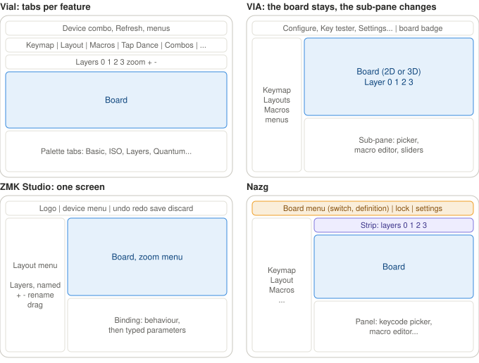

Nazg takes ZMK Studio's skeleton — a thin header, a column beside the board, the editor under
it — and VIA's idea of a column that switches what the bottom area edits, which is where
features beyond the keymap, custom ones included, find their place. Vial's tab per feature
was not taken: a feature-rich board shows eleven tabs before anything is done.

| Region | What it holds |
|---|---|
| **Header** | The board's name, which is a menu (see "Getting back to the keyboard list"); the protocol; the lock state on boards that have one; the **settings button** |
| **Section column** | Keymap, Layout, Macros... — about 150 px wide, an icon and a label per row. **Only the sections the board has**, and **hidden when there is only one** |
| **Strip** | A row of choices owned by the section: layers in Keymap, slots in Macros (see below). Absent when the section has nothing to choose |
| **Board** | Drawn by Nazg; what each key shows is the section's |
| **Panel** | The section's editor — the keycode picker in Keymap. **Always visible**, not only while a key is selected |

Decided: **layers as a strip** (not ZMK's named column: VIA and Vial layers are numbers),
**the panel always visible**, **a settings button** rather than top-level panes like VIA's.
Top-level panes stay possible later, if a full-screen tool such as a matrix tester needs one.

## Sections, and the strip that belongs to them

The strip is only useful for layers in Keymap (and encoders later) — layout options, macros,
tap dance, combos, lighting and settings do not depend on the layer. So the strip belongs to
the section: it is the section's own row of choices.

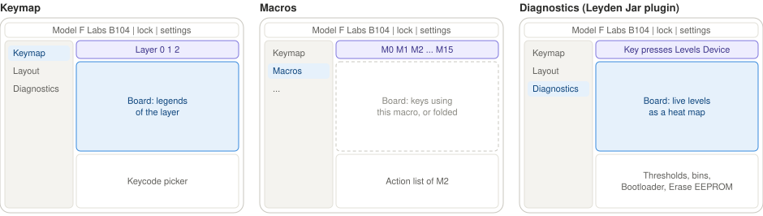

| Section | Strip |
|---|---|
| Keymap, encoders | layers |
| Macros | M0 … M15 |
| Tap dance, combos, key overrides | their slots |
| Leyden Jar diagnostics | its modes: key presses, signal levels, device |
| Layout options, settings-like sections | none — the strip is absent |

The macro, tap dance and combo slots are Vial's numbered tabs, moved into one fixed place.

### What a section provides

Every section, built in or a plugin, supplies four things:

1. **Its strip entries**, or none.
2. **What the board shows** — each key's colour, legend or value, and what a click on a key
   does. Nazg draws the board; the section only fills it. A section that does not use the
   board (macros, settings-like ones) may fold it away and give the room to its panel.
3. **Its panel.**
4. **Its match rule** — which boards it appears for.

### How a section describes the board

The board is where the visual styling will change most, so a section says **what** each key
means and never **how** it looks — colours, fonts and sizes belong to Nazg's board renderer
and theme, and a restyle touches only those. Checked against three coming changes: the
Leyden Jar tool's keys, keycap colour themes like VIA's (Olivia, Dolch, Jamon...), and
sublegends printed on some keycap sets (Hiragana, Hangul).

1. **Legends by position.** A key has slots at KLE's twelve legend positions — top, middle,
   bottom, each left, centre and right, plus the front — each filled or empty and carrying a
   role (label, sublegend, value) the renderer styles. Keymap fills top left and middle left
   (`KeycapLegend`'s two legends today); the Leyden Jar level view fills top, middle and
   bottom left with the maximum, current and minimum levels and bottom right with the bin;
   a sublegend set fills one more slot, from a table like the host layouts. `KeycapLegend`
   grows from two fields to the slots. A sublegend's glyphs also need a font holding them —
   a font matter in `Main.cpp`, not a structural one.
2. **Fill by meaning**: the keycap's colour class (alpha, modifier, accent — what VIA's
   themes colour), a value from 0 to 1 for a heat map, or neutral. Keycap themes need the
   parser to keep each key's KLE colour, which it drops today. **States** — selected,
   hovered, highlighted, dimmed, warning, pressed — are drawn as an outline or an overlay,
   never as the fill, so they read on every theme; a heat map overrides the theme while shown.
3. **Geometry from the section, when it wants its own.** By default the board's definition;
   the Leyden Jar's controller matrix is a plain grid instead.
4. **Lines drawn over the board**, from key to key — the matrix view's wiring.
5. **Labels around the board's edges** — the matrix view's row and column rulers, the
   Leyden Jar's `R0…`/`C0…` connectors.
6. **Hover shared both ways.** The section hears which key or edge label is hovered or
   clicked, and can highlight keys from its panel — not only "a key was clicked".

**Named colours for panels**: error, warning, success, muted — placeholder values until the
styling, and the only colours a section may use. `Main.cpp`'s hard-coded `TextColored` calls
are what this replaces. **No pixels** anywhere in the contract: the layout sizes the regions,
and a section can at most say it does not use the board.

If a need still appears later — icons on keys, say — changing the contract costs one struct
and its implementations, two while they are Keymap and the Leyden Jar. It gets expensive once
other people write plugins, which is why these six points go in from the start, and why the
styling should settle before plugins open to others.

### Plugins

The [Leyden Jar Diagnostic Tool](https://github.com/mymakercorner/Leyden_Jar_Diagnostic_Tool)
already has exactly this shape — a board drawing, a choice of mode (key press monitor, level
monitor), a panel of information and actions (thresholds, bins, bootloader, erase EEPROM) —
so it becomes a "Diagnostics" section with no change to the layout. Its own device list is
the one part it no longer needs.

A plugin section is matched to a board by one of three rules:

| Rule | For |
|---|---|
| **VID:PID** | VIA boards |
| **Vial keyboard UID** | Vial boards — 8 bytes naming a model, not a unit (via-registry.md, "Vial's keyboard UID") |
| **A protocol probe** | a controller used on many boards, such as the Leyden Jar: the plugin asks for its own protocol's version and appears if it is answered. A list of ids would have to name every board built on it |

**Next step, decided:** write the four-point section contract as a C++ interface, with Keymap
as its first implementation and the Leyden Jar diagnostics as its second, **compiled in**.
Two very different sections test the contract before any plugin format is chosen.

**Open: how third-party plugins are delivered.**

| | For | Against |
|---|---|---|
| Compiled in | no risk | only Rico adds one |
| **Declarative** — a descriptor mapping widgets onto a board's custom commands | safe, every platform, the web build too; the same vocabulary as step 5 | bounded by the widget types defined — though a "value per key" board overlay already covers a level heat map |
| Code — native libraries | full power | a build per OS; ImGui across a library boundary; third-party code in a process that rewrites keymaps |
| Code — sandboxed WebAssembly | full power, sandboxed, portable | a new dependency and an API to maintain |

The survey's conclusion (README, "Declarative description vs arbitrary code") points to the
declarative route first, code only if it proves too narrow.

## The common screens

**1. No board open.** The keyboards found, each with its protocol and *Open*. No section
column, no strip. **With exactly one board plugged in, Nazg opens it directly**, so most
people never see this screen.

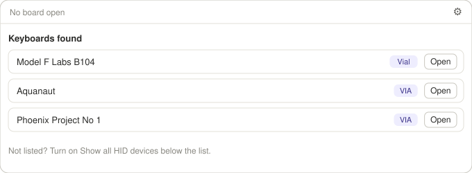

**2. A board with a keymap only** — the most common case and the simplest screen: header,
layer strip, board, keycode picker. No column, since there is one section. Click a key, it is
outlined; click a keycode, it is written.

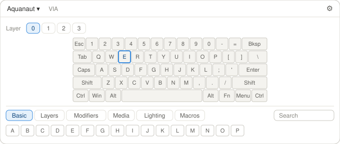

**3. A board with several sections.** Screen 2 plus the column, listing only what this board
has. The header shows the lock state, Vial only.

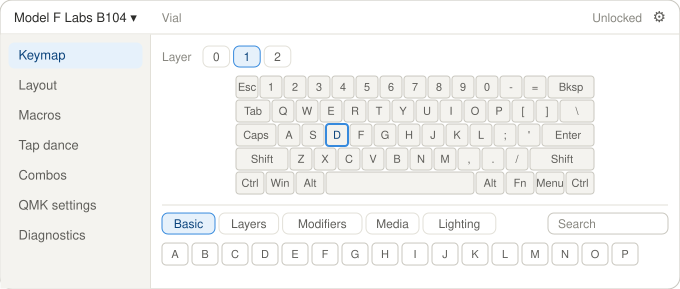

**4. Choosing a definition** — only when more than one definition matches a VIA board. With
two or three candidates, each is drawn small beside its name and where it came from; more are
handled as in the next section. The answer is remembered per board, as it is today.

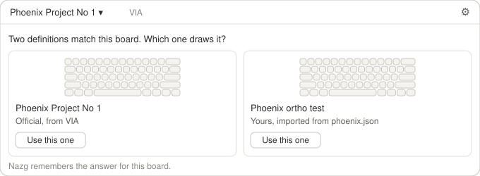

**5. Macros on a locked board.** The strip lists the macro slots; the panel, the selected
macro's actions. Vial refuses a macro write while locked (via-vial-commands.md, "What the
lock gates"), so the panel says so, and the board highlights the keys to hold — the firmware
reports them in `vial_get_unlock_status`. Once unlocked, the message goes and the actions
become editable. The keymap needs no such screen: Vial accepts keymap writes while locked,
`QK_BOOT` aside, which the read-back already reports.

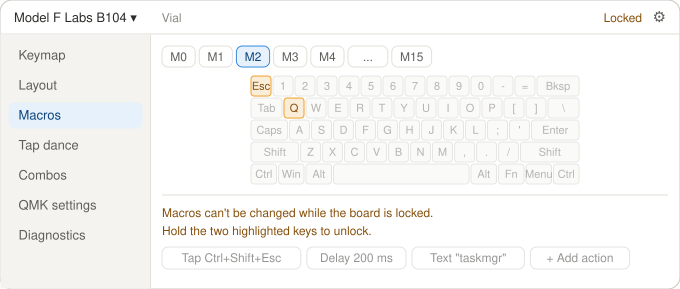

**6. Settings**, from the settings button. It replaces the main area; the header stays, so
the open board is still named. The host layout and the user definitions library (Re-import,
Remove, Import) move here from today's HID Devices window. "Back to the board" returns where
you were.

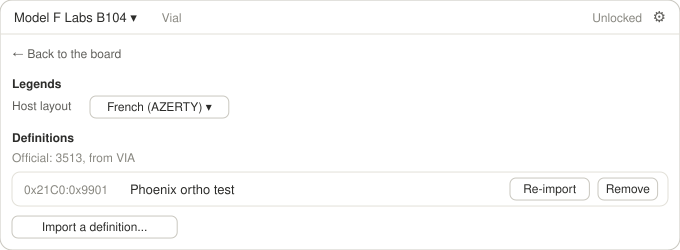

## Choosing among many definitions

VIA's registry allows one official definition per VID:PID, so many candidates are always the
user's own: hobbyists on QMK's placeholder id (`0xFEED:0x0000` alone is on 175 QMK keyboards,
via-registry.md, "VID:PID collisions in QMK"), designers whose prototypes and revisions keep
one id, "Keep both" adding an entry each time.

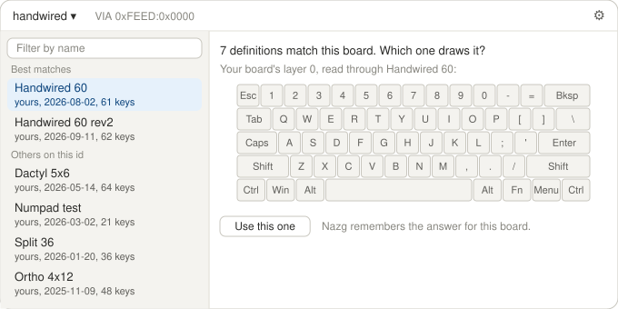

1. **A ranked list and one large preview**, past three candidates. The ranking is the one
   already decided (via-registry.md, "Choosing a definition on connect"): user, community,
   official, then how closely the name matches the product string. The names that match form
   "Best matches"; the top one is preselected, so the usual answer is one click. The filter
   box appears only for a long list, about eight or more. Two or three candidates keep the
   side-by-side cards of screen 4, which compare better directly.
2. **The preview shows the board's real keymap, not blank keys.** Layer 0 starts at offset 0
   of the keymap buffer whatever the matrix, so Nazg reads it once — sized for the largest
   candidate, a few hundred bytes, some 10–20 round trips against the 890 ms of a full load —
   and draws it through each candidate. The right definition shows the user's own keymap in
   sensible places; a wrong matrix scatters the legends. People recognise their own keymap at
   once, even when two drawings have the same shape.

   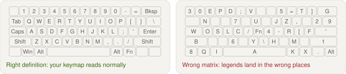
3. **The preview uses the board's stored layout options**, read from the board, instead of
   the first choice of each option — what the user would get by picking it.

**Untested:** point 2 has not been tried; the first test is the Phoenix Project No 1 with the
forged ortho definition. A layer 0 that is mostly `KC_TRNS` or blank would show little.

**Provisional:** a "not chosen by any board" hint in Settings, to help remove stale
definitions — an extra whose value is unproven.

## Getting back to the keyboard list

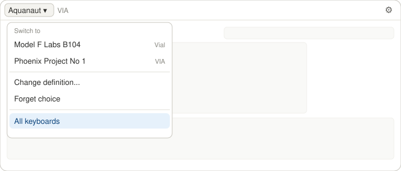

The board's name in the header is a menu, as in ZMK Studio and VIA:

- **Switch to** — the other keyboards plugged in, one click each: the usual reason to go back.
- **Change definition… / Forget choice** — VIA boards only; they leave the board screen.
- **Show matrix…** — the matrix view, below.
- **All keyboards** — closes the board and shows the list.

It adds nothing to the first glance — the name is already there — and it is the only way to
the list when Nazg opened a lone board directly. The list also comes back by itself when the
open board is unplugged, saying which one went.

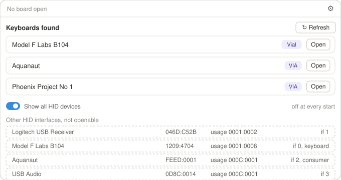

**Show all HID devices** is a toggle on the list itself, **off at every start** — today's
checkbox already behaves so. Turned on, keyboards stay on top with *Open*, and every other
HID interface is listed under them, dimmed, with VID:PID, usage page and interface number,
and cannot be opened. The technical columns exist only in that view. (The ids in the picture
are illustrative.) **Refresh** stays on the list.

## The matrix view

How the board is wired: which row and which column of the switch matrix each key sits on.
Mostly for designers and anyone debugging a build, so it is **opened from the board menu**
("Show matrix…") rather than being a section — a section would bring the column back on every
keymap-only board, since every board has the data.

### What VIA and Vial do

- **VIA** draws the structure with "Show Matrix", in its Design pane — hidden until enabled in
  Settings — and in its Debug pane (`components/three-fiber/matrix-lines.tsx`,
  `components/n-links/matrix-lines.ts` in `the-via/app`). Every row is a pink line and every
  column a grey one, **all at once, unlabelled**; points are joined in screen order — rows by
  x, columns by y — not in column or row number order, so a line zigzags wherever the wiring
  does not follow the key positions; and the keys of **every** layout option are included
  (only encoders and decals are left out), so alternative keys stack and lines run through
  them. Its Key Tester also has a live "Test Matrix" mode.
- **Vial** draws no structure. Its **Matrix tester** tab lights keys on the board as they are
  pressed, polled every 20 ms, and asks for an unlock first.

### What it needs

- **The structure is definition data only**: each key's row and column (its KLE `"r,c"`
  legend) and the matrix size. No protocol, every VIA and Vial board, even with no board
  plugged in — and Nazg already has it.
- **The live test needs the firmware's consent**, deliberately: `id_switch_matrix_state`
  (via-vial-commands.md). Mainline VIA answers **all zeroes** unless built with
  `VIA_INSECURE`, or with `SECURE_ENABLE` and unlocked — QMK calls the alternative a "wannabe
  keylogger" — and all zeroes cannot be told from "nothing pressed", so the screen must say
  that if nothing lights, the firmware turns the test off. Vial needs protocol 3 or later
  and an unlocked board. It is cheap: `28 / ceil(cols/8)` rows per reply, the whole matrix in
  one request on most boards.

### One view, with rulers

One view, the board, with a **row ruler on the left and a column ruler on top**. (A first
draft had a second view, the matrix as a grid in the panel; one view proved far more legible.)

No selection:

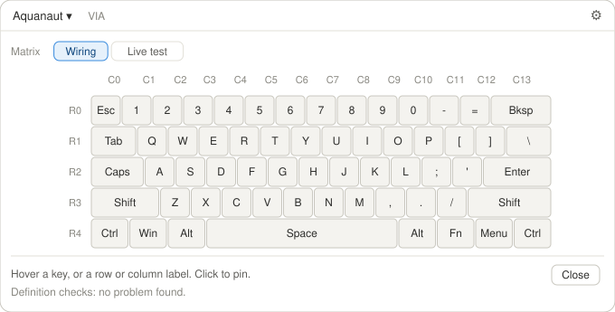

A key selected and pinned — V, on row 3 and column 5:

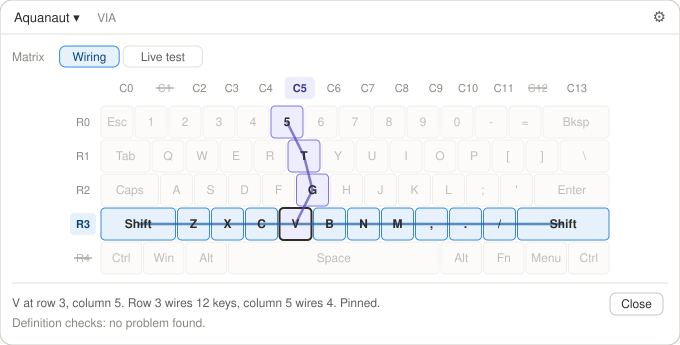

**Interactive version:** [ui-design/matrix-view.html](ui-design/matrix-view.html) — open it
in a browser; GitHub and Markdown previews show only its source.

- **Hover a key**: its row and its column light, on the board and in both rulers, with the
  wiring drawn through the keys **in column and row number order** — the real order, not the
  screen's. Everything else dims.
- **Hover a ruler label**: that whole row or column.
- **Click** pins the selection, to move the mouse away.
- **Positions with no key** — what the grid showed and the board alone cannot: with a row
  selected, the columns with no key in it are **struck through** in the column ruler, and
  the other way round. In the picture, C1 (the ISO key's position) and C12 on row 3, R4 on
  column 5.
- A ruler label sits at the average position of its keys, nudged apart so none overlap. On
  a regular board they line up with the keys; on a board whose wiring does not follow its
  layout — split halves numbered 5 to 9, a Model F's matrix — they cannot, the ruler is then
  an ordered list, and the drawn line shows where the row really runs.
- **Live test** (the strip: *Wiring | Live test*): keys turn green as they are seen, with a
  count — a checklist for a freshly soldered board. A ruler label turns green when its whole
  row or column was seen; one that stays grey points at that trace, and a key lighting
  unpressed points at ghosting from a missing diode.
- **The panel**: the status line, the seen count, **definition checks** — two keys on one
  position within one layout choice, positions outside the matrix size, positions no key uses;
  worth running quietly on import too — and *Close*, back to the keymap.

## The console

The text a QMK firmware prints — `print`, `uprintf`, `dprintf` — shown in Nazg, so debugging
a firmware needs no second app. Today that app is QMK Toolbox, whose output cannot be selected
or copied, or PJRC's `hid_listen`.

**Off by default, three ways.** The *Console* button exists only on a board that has a
console interface; the drawer is **closed at every start**, like "Show all HID devices"; and
Nazg **does not open the console interface at all** until the drawer is opened — nothing is
read, nothing is kept, until the user asks.

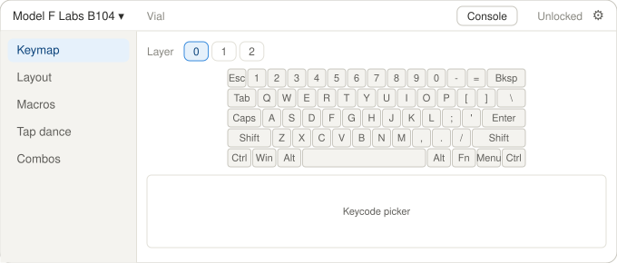

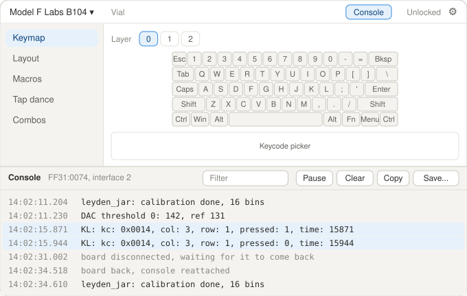

### What QMK sends

`CONSOLE_ENABLE` adds a **second HID interface** to the board, next to VIA's raw HID one
(`0xFF60`/`0x61`): usage page **`0xFF31`**, usage **`0x74`** — PJRC's Teensy convention,
the one QMK Toolbox and `hid_listen` listen on. It goes **one way**, board to host: the text
in 32-byte input reports, buffered by `sendchar()` and flushed by `console_task()`. There
are no commands — the board cannot be asked anything through it, and `dprintf` prints only
while the firmware's `debug_enable` is set, which the firmware sets itself (in code, or with
the `DB_TOGG` key). Vial is QMK underneath and sends the same. (QMK:
`tmk_core/protocol/usb_descriptor.c`, `tmk_core/protocol/chibios/usb_main.c`,
`docs/faq_debug.md`.)

### What it takes

- **Transport**: a second open handle on the same board, and a reader for reports that
  arrive unasked. Today's transport does request and response only; the architecture
  already puts "async request/response + unsolicited messages" in the transport, and this is
  its first use. **No protocol code** — plain text, no VIA or Vial involved.
- **Pairing the interface with the board**: hidapi lists it as a separate entry. It is
  attached to the open board by VID:PID, HID strings and serial number. Two identical boards
  without a serial number are ambiguous; Nazg then asks which.
- **Boards without VIA**: a board with only `CONSOLE_ENABLE` can be listened to as well — a
  *Console* button on its row of the keyboard list, among the interfaces "Show all HID
  devices" reveals.
- **Surviving a reflash**: the console is for firmware work, so the board goes and comes
  back often. The log is kept, marked where the board left and returned, and the console is
  reattached to the same board by itself — which needs hotplug events or, while the drawer is
  open, re-listing devices about once a second (see "Open points").
- **Text that can be selected and copied** — what QMK Toolbox lacks. ImGui has no selectable
  text for free: lines are selected with its multi-select (click, shift-click, Ctrl+A),
  **Copy** takes the selection, **Save…** writes the log to a file. Also **Pause**, **Clear**,
  a filter, timestamps, and a cap on the number of lines kept, so a chatty board cannot use
  up memory.
- **Privacy**: with the firmware's `debug_keyboard` on, QMK prints every keyboard report it
  sends to the host (`tmk_core/protocol/host.c`) — the log can hold all that was typed. It lives **in memory only**, is written to disk only by
  *Save…*, and is gone when Nazg closes.

### Where it sits

**A drawer at the bottom of the window**, like an IDE's terminal: the regions above shrink
and stay usable. Not a section, and not a view replacing the main area like the matrix view —
the point is watching the output *while* using the keymap or the matrix live test. It opens
from the *Console* button in the header.

The same drawer could later show logs from other sources: XAP's log broadcasts, ZMK's USB
logging — which is a serial port, not HID, so it needs a serial transport, the one a ZMK
Studio backend needs anyway. Flashing, QMK Toolbox's other job, is not part of this.

## Open points

- **Plugin delivery** — see "Plugins".
- **Hotplug**: whether the pinned hidapi 0.15 reports devices arriving and leaving has not
  been checked. Until it is, an unplugged board is noticed by a failed request, the list
  needs Refresh, and the console reattaches by re-listing devices while its drawer is open.
- **Which sections fold the board away**, and whether folding it confuses more than it helps.
- **The matrix view's layout options**: which choice it draws — the board's stored one, as
  the many-candidates preview does — and how keys of the other choices show.
- **"Export definition…"**, for investigation and debugging only, has no place yet — the
  board menu, under the definition items, is the obvious candidate.
- The three suggestions Rico accepted with the screens, worth confirming in use: opening a
  lone board directly; listing only the sections a board has; Settings replacing the main
  area rather than opening a dialog.
