# UI design — the workspace

*Decided with Rico 2026-09-26, from [ui-inventory.md](ui-inventory.md). Mostly design: only
the section contract has begun in code (see "Plugins", "Next step"). The pictures are wireframes: they fix what goes where, not the look.
They are drawn by `tools/draw_ui_wireframes.py`; change a picture there and run it again.*

The first-draft screens (three floating ImGui windows) are replaced by **one fixed window**
filling the SDL window, divided into five regions. What each region shows depends on the
board and on the section chosen; the regions themselves never move.

## The regions

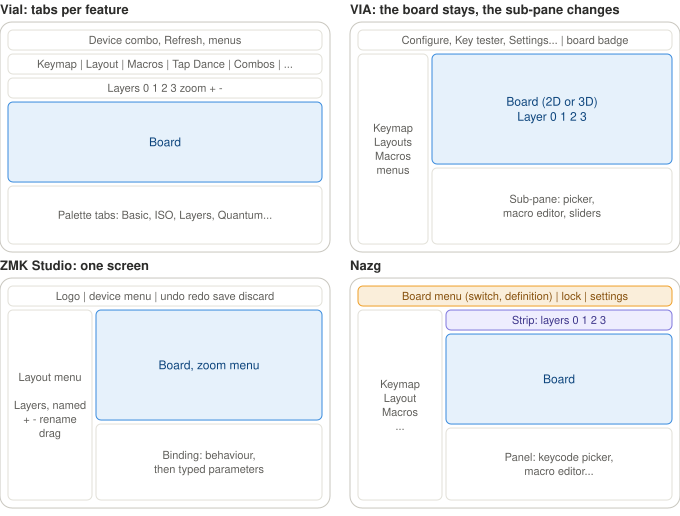

Nazg takes ZMK Studio's skeleton — a thin header, a column beside the board, the editor under
it — and VIA's idea of a column that switches what the bottom area edits, which is where
features beyond the keymap, custom ones included, find their place. Vial's tab per feature
was not taken: a feature-rich board shows eleven tabs before anything is done.

| Region | What it holds |
|---|---|
| **Header** | The board's name, which is a menu (see "Getting back to the keyboard list"); the protocol; the lock state on boards that have one; the **settings button** |
| **Section column** | Keymap, Layout, Macros... — about 150 px wide, an icon and a label per row. **Only the sections the board has**, and **hidden when there is only one** |
| **Strip** | A row of choices owned by the section: layers in Keymap, slots in Macros (see below). Absent when the section has nothing to choose |
| **Board** | Drawn by Nazg; what each key shows is the section's |
| **Panel** | The section's editor — the keycode picker in Keymap. **Always visible**, not only while a key is selected |

Decided: **layers as a strip** (not ZMK's named column: VIA and Vial layers are numbers),
**the panel always visible**, **a settings button** rather than top-level panes like VIA's.
Top-level panes stay possible later, if a full-screen tool such as a matrix tester needs one.

## Sections, and the strip that belongs to them

The strip is only useful for layers in Keymap (and encoders later) — layout options, macros,
tap dance, combos, lighting and settings do not depend on the layer. So the strip belongs to
the section: it is the section's own row of choices.

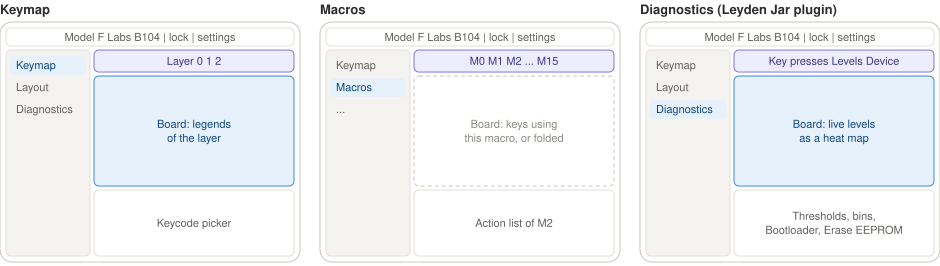

| Section | Strip |
|---|---|
| Keymap, encoders | layers |
| Macros | M0 … M15 |
| Tap dance, combos, key overrides | their slots |
| Leyden Jar diagnostics | its modes: key presses, signal levels, device |
| Layout options, settings-like sections | none — the strip is absent |

The macro, tap dance and combo slots are Vial's numbered tabs, moved into one fixed place.

### What a section provides

Every section, built in or a plugin, supplies four things:

1. **Its strip entries**, or none.
2. **What the board shows** — each key's colour, legend or value, and what a click on a key
   does. Nazg draws the board; the section only fills it. A section that does not use the
   board (macros, settings-like ones) may fold it away and give the room to its panel.
3. **Its panel.**
4. **Its match rule** — which boards it appears for.

### How a section describes the board

The board is where the visual styling will change most, so a section says **what** each key
means and never **how** it looks — colours, fonts and sizes belong to Nazg's board renderer
and theme, and a restyle touches only those. Checked against three coming changes: the
Leyden Jar tool's keys, keycap colour themes like VIA's (Olivia, Dolch, Jamon...), and
sublegends printed on some keycap sets (Hiragana, Hangul).

1. **Legends by position.** A key has slots at KLE's twelve legend positions — top, middle,
   bottom, each left, centre and right, plus the front — each filled or empty and carrying a
   role (label, sublegend, value) the renderer styles. Keymap fills top left and middle left
   (`KeycapLegend`'s two legends today); the Leyden Jar level view fills top, middle and
   bottom left with the maximum, current and minimum levels and bottom right with the bin;
   a sublegend set fills one more slot, from a table like the host layouts. `KeycapLegend`
   grows from two fields to the slots. A sublegend's glyphs also need a font holding them —
   a font matter in `Main.cpp`, not a structural one. *Decorative sublegends were dropped
   2026-10-03 (see "Legends", "Second legends: functional only"): the sublegend role and set
   go with them.*
2. **Fill by meaning**: the keycap's colour class (alpha, modifier, accent — what VIA's
   themes colour), a value from 0 to 1 for a heat map, or neutral. Keycap themes need the
   parser to keep each key's KLE colour, which it drops today. **States** — selected,
   hovered, highlighted, dimmed, warning, pressed — are drawn as an outline or an overlay,
   never as the fill, so they read on every theme; a heat map overrides the theme while shown.
3. **Geometry from the section, when it wants its own.** By default the board's definition;
   the Leyden Jar's controller matrix is a plain grid instead.
4. **Lines drawn over the board**, from key to key — the matrix view's wiring.
5. **Labels around the board's edges** — the matrix view's row and column rulers, the
   Leyden Jar's `R0…`/`C0…` connectors.
6. **Hover shared both ways.** The section hears which key or edge label is hovered or
   clicked, and can highlight keys from its panel — not only "a key was clicked".

**Named colours for panels**: error, warning, success, muted — placeholder values until the
styling, and the only colours a section may use. `Main.cpp`'s hard-coded `TextColored` calls
are what this replaces. **No pixels** anywhere in the contract: the layout sizes the regions,
and a section can at most say it does not use the board.

If a need still appears later — icons on keys, say — changing the contract costs one struct
and its implementations, two while they are Keymap and the Leyden Jar. It gets expensive once
other people write plugins, which is why these six points go in from the start, and why the
styling should settle before plugins open to others.

### Plugins

The [Leyden Jar Diagnostic Tool](https://github.com/mymakercorner/Leyden_Jar_Diagnostic_Tool)
already has exactly this shape — a board drawing, a choice of mode (key press monitor, level
monitor), a panel of information and actions (thresholds, bins, bootloader, erase EEPROM) —
so it becomes a "Diagnostics" section with no change to the layout. Its own device list is
the one part it no longer needs.

A plugin section is matched to a board by one of three rules:

| Rule | For |
|---|---|
| **VID:PID** | VIA boards |
| **Vial keyboard UID** | Vial boards — 8 bytes naming a model, not a unit (via-registry.md, "Vial's keyboard UID") |
| **A protocol probe** | a controller used on many boards, such as the Leyden Jar: the plugin asks for its own protocol's version and appears if it is answered. A list of ids would have to name every board built on it |

**Next step, decided:** write the four-point section contract as a C++ interface, with Keymap
as its first implementation and the Leyden Jar diagnostics as its second, **compiled in**.
Two very different sections test the contract before any plugin format is chosen.

*Begun 2026-09-26:* `ui/NazgSection.h` holds points 1 to 3, and `ui/NazgBoardDescription.h`
the six board rules; Keymap implements them. The match rule (point 4) waits for the first
section that is not on every board. The Leyden Jar diagnostics, the planned second
implementation, are deferred far later: they bring many more design questions. Decided for
them already: the device stays open while a view polls, as VIA's and Vial's matrix testers
do; and key output is disabled while they show, as the Leyden Jar tool does. The firmware
keeps that setting in RAM only, so an unplug restores output, but a Nazg bug would not:
**every path that closes the device or exits must enable key output again.** VIA and Vial have
no command to do the same. Two things were left out until something
needs them: folding the board away (an open point below), and edges other than left and top
for labels. `KeycapLegend` keeps its two fields -- Keymap puts them in the top-left and
middle-left slots. (It was to gain a third for sublegends; decorative sublegends were dropped
2026-10-03, and placement by the legend set changes this anyway -- see "Legends".)

**Open: how third-party plugins are delivered.**

| | For | Against |
|---|---|---|
| Compiled in | no risk | only Rico adds one |
| **Declarative** — a descriptor mapping widgets onto a board's custom commands | safe, every platform, the web build too; the same vocabulary as step 5 | bounded by the widget types defined — though a "value per key" board overlay already covers a level heat map |
| Code — native libraries | full power | a build per OS; ImGui across a library boundary; third-party code in a process that rewrites keymaps |
| Code — sandboxed WebAssembly | full power, sandboxed, portable | a new dependency and an API to maintain; authors still compile, once |
| Code — an embedded script language (Lua) | full logic, no compilation: a script is a text file; sandboxable; the web build too | an API frozen once others write against it; no debugger; a sandbox protects the computer, not the keyboard |

The survey's conclusion (README, "Declarative description vs arbitrary code") points to the
declarative route first, code only if it proves too narrow.

*Scripting, discussed 2026-10-01.* If code is needed, a script language is the route for
third parties: Lua is about 30 C files, MIT, builds under Emscripten and has no ABI to match.
Native libraries are impractical -- a plain C boundary, a build per OS, ImGui's context and
exact version shared across it, macOS library validation. A script is code that *emits
descriptions*, so the declarative-or-code choice mostly dissolves. Settled with it:

- **The panel is a small widget set** Nazg lays out and styles, not ImGui bound to Lua -- the
  "what, never how" rule above, and translatable text stays possible.
- **Async through Lua's own coroutines**: a request yields the script and resumes it when its
  `Task` completes, so script code reads straight like Nazg's.
- **Sandbox**: no `io`, `os`, `package` or `debug`; source text only, never bytecode; an
  instruction and memory budget; every call under `lua_pcall`, an error shown in its panel.
  A script can still send any HID command to its board -- keymap writes, bootloader, EEPROM
  erase -- so installing one is an act of trust, as importing a definition is.
- **Installed by the user, never served by the device**: code from a USB device stays
  disqualifying; device-served features (step 5) stay declarative.
- **Lifecycle hooks** run on every close and exit path, even after the script failed -- the
  key-output rule above.
- **Licence**: GPL-3.0 needs an explicit exception for scripts using the API before the first
  outside one, if they may be licensed freely.

**Not before Nazg's own features are solid** (Rico). The script API is the section contract
plus device access, so it binds a contract already proven by compiled-in sections -- the
Leyden Jar diagnostics come compiled in first, and porting them to a script later would be the
proof the API suffices. Keeping the contract plain values, as `NazgBoardDescription.h` is,
keeps that binding cheap.

## The board's look

*Decided with Rico 2026-10-01*, from a mockup on the Model F B104:
[ui-design/board-look.html](ui-design/board-look.html) — open it in a browser. It draws only
what ImGui's draw list can (rounded fills, outlines, polylines, text: no shadows, no
gradients), so whatever it shows can be built in `NazgBoardView` as shown. Its *Scene* choice
shows each screen's states as Nazg sets them: Keymap, Matrix view, Live test, Vial unlock.

- **Colour themes.** A theme is one table of named colours, the board's and the window's:
  keycap colours per class, legends, the plate, every state. **Light, Dark and Dracula** to
  start, with room for more; chosen in Settings.
- **Each theme chooses its own state colours**, and **no state colour may resemble one of the
  theme's keycap colours** -- the mockup's Light theme put an orange selection outline beside
  orange accent keycaps.
- **Keycap style, a setting of its own**, independent of the theme: **Outlined** -- a thin
  border around the fill, legible on dark and light alike -- or **Bottom lip** -- a darker strip
  under the key, as if the board were seen slightly from above, the most legible on light
  themes. The default is not decided yet.
  - The lip is the key's shape drawn `lip` lower, behind it, **in the key's own bottom gap**
    (0.06 unit, no more than the gap), so the face keeps the flat key's full size and its
    legend room, and never reaches the key below. Every lip is drawn before any face, so an
    L-shaped key shows its lip only where its contour has a bottom. Raising the face by half
    the lip, to even the gaps between rows with those between columns, only moves the board:
    rejected.
  - **Flat** -- today's look -- is dropped: fine on dark themes, too little contrast on light.
    **Two-tone** -- KLE's skirt and inset top face -- is dropped: noisy on light themes, and
    its face loses about 30% of the width legends need.
- **A plate, always filled**: a rounded shape behind the whole board, 0.35 unit wider on every
  side, giving it a boundary. Not a setting. It must not swallow the lip, so a **theme rule**:
  face, plate and lip keep a fixed order of lightness, the lip clearly apart from the plate --
  on Light, face lightest, plate between, lip darkest (the mockup's first Light plate was the
  lip's grey and muted it). A plate drawn as a border only kept the lip too, but the filled one,
  coloured by that rule, looked better: the border is dropped, unless a theme some day cannot
  meet the rule.
- **Outlines follow the key's contour.** An L-shaped key gets one L-shaped outline: the two
  KLE rectangles traced together (at most 3×3 cells, walked around the edge), outer corners
  rounded, the inner corner rounded the other way (`PathArcTo`, then a closed `PathStroke`).
  Nested state outlines step inward along the whole contour. The same helper serves state
  outlines, the Outlined border and the lip. **A bug today**: `DrawKey()` strokes the two
  rectangles one after the other, so a selected ISO Enter shows both crossing inside it.

Still to settle: legends (below); the default keycap style.

**Keycap colour classes** (Rico, 2026-10-03). KLE colours say only whether a key is an alpha, a
modifier or an accent; **Nazg never renders them** -- the theme colours each class. Most Vial
definitions carry no colours at all (some of Rico's do: VIA's colours kept in a Vial definition,
which Vial ignores but parses), so a class must also be found without them, from the keys
themselves.

**The class comes from the base layer's keycode at the key's position** (Rico, 2026-10-03), and
**classes are on by default** -- every board gets them now, colours in its definition or not:
- **Layer 0, whichever layer is shown**: a physical cap keeps its colour across layers, so the
  colours stay put while the legends change.
- **Alpha**: character keys -- whatever the host layout prints -- numpad digits and `.`, the
  space bar. **Accent**: Esc, Enter, numpad Enter. **Modifier**: everything else -- modifiers,
  Tab, Caps Lock, Backspace, F-keys, navigation, arrows, Num Lock, numpad operators, every
  command.
- **A tap-hold takes its tap's class** (`MT(Ctrl, Esc)` is an accent); **a remapped key follows
  its keycode**, as its legend does -- the board shows what a key does.
- **`KC_NO` on layer 0** has no keycode to go by: wider than 1.25u is a modifier, else an alpha.
- **With KLE colours, the colours group the keys and the keycodes name the groups**: each distinct
  cap colour takes the class most of its keys get above. More robust than "the most common colour
  is the alphas", and the designer's intent survives -- arrows drawn in the Esc colour join the
  accents. The colour values are never drawn.

**F-keys are modifiers** (Rico), as the arrows are by default, though some sets print the F-row
as alphas and many make the arrows accents: a definition's KLE colours override both.

### Legends -- the plan, not yet decided

*Laid out 2026-10-01, to resume in a later session.* Legends are the weakest point of every
keycap style. Four questions, from what the key says to how it is drawn:

**1. What text goes on the key.** Today a key prints QMK's label: "Left Control", "Print
Screen", "Page Down". keycodes.md already foresaw a table of short labels. VIA has one
(`shortName`: Bksp, PgDn, LCtl, arrows as ← ↑ → ↓), used on any key 1.5u wide or less. Three
tools rather than one:
- **Short forms**, in Nazg's own table -- VIA's belongs to VIA, and the project rule is to
  rewrite rather than copy.
- **Two lines**, as printed keycaps do: "Page / Down", "Num / Lock", "Print / Screen" -- the
  full words often fit that way.
- **Symbols** where they read better: arrows at least.

The renderer chooses, not a fixed width threshold: the full label on one line, then on two
lines, then the short form, then shrunk. That keeps the contract's rule -- the section says
*what* the key means, the renderer how it fits -- and means a `Legend` gains a short form
beside its text. Tap-hold and layer keys need the same care: "MT LCTL" over "Esc" could become
"Ctrl" over "Esc".

**2. Where legends sit.** Today all left-aligned: the Shift character top left, the main legend
middle left. Alternatives: centred, or letters centred and larger with the other keys smaller,
as on many keycap sets. A matter of taste: for the mockup.

**3. How big.** Capped at the UI font size today (16 px). ImGui 1.92 rasterises text sharply at
any size, so legends could grow with the key on a large window. The ratio: for the mockup.

**4. Which font.** Measured 2026-10-01: the 69 host layouts can put **277 distinct non-ASCII
characters** on a key --
- extended Latin, Greek, Cyrillic, ten Hebrew letters, about twenty Arabic letters (the Farsi
  layout), currencies (€ ₺ ₽ ₢), maths (≠ ≤ ≥ √ ∞ ∑), typographic punctuation, ⌨;
- **no Chinese, Japanese or Korean at all** -- the Japanese and Korean layouts' legends are
  Latin-script words -- so the Yu Gothic and Malgun fallbacks loaded today are not needed for
  legends; they would have mattered only for decorative sublegends, since dropped;
- two problem cases: the Mac layouts use Apple's logo (U+F8FF), which only Apple's fonts
  contain -- **not printed** (Rico, 2026-10-03): it is a character Option+Shift+K types on nine
  Mac layouts, and a legend no bundled font holds is left off; and six dead-key accents are
  combining characters with nothing to sit on, so they need a base or a standalone form.

Arabic and Hebrew are right to left, but one letter on a key needs no shaping, so ImGui draws
them. Candidates: **one font covering everything** (DejaVu Sans), or **a family merged in
ImGui** (Noto Sans plus its Hebrew, Arabic and symbol fonts -- ImGui fills missing characters
from merged fonts). Both are free to bundle with a GPL program; the look decides, and the
mockup can load them.

**Left over from keycodes.md: the AltGr legend.** Every position already has its AltGr
character in the table (UK € on 4, French @ on à); ISO keycaps print it bottom right. Should
Nazg print it too?

**Proposed next step**: extend the mockup with a *Legends* row -- text (today / short forms /
two lines + short), placement (left / centred), size (fixed / growing with the key), font
(system / two or three candidates), AltGr legend (off / on), and a host layout switch (US, UK,
French, German, Greek, Russian) -- to see it all on the Model F and pick, as with the keycaps.
Or settle some questions first.

#### Rico's answers, 2026-10-02

- **A character is never scaled to make it fit its key.** `DrawLegends()` shrinking a legend
  to 60% goes. The chain becomes: the full label on one line, two lines, the short form or an
  icon -- never smaller -- so short forms are designed to fit a 1u key; past that, a cut with
  "…".
- **Short names for legends that do not fit**: agreed; the names themselves decided later --
  see "Short forms and command keys" below.
- **Icons, text, or both**: keycap sets print modifiers as icons, as text, or as icon and text,
  and people prefer each; all three to be tried.
- **Placement follows the keycap family**: top left on cylindrical keycaps, centred on
  spherical ones.
- **Mimicking physical keycaps**: an option worth studying, though printed legends are not
  always legible -- "Ctrl" on both left and right Control, for one. A possible answer, not
  agreed yet: labels that know their position -- "Ctrl" where the key's side matches where it
  sits on the board, "R Ctrl" only where it does not -- with hover always giving the full name.
- **Legends follow the keycap size** when the window is resized, both ways -- no 16 px cap.
  Proposed with it: a smallest legible size, below which the board stops shrinking and
  scrolls.
- Options found too many after the experiments get filtered out, to stay manageable.

#### What real keycap sets do

Looked at 2026-10-02, from the makers' own pictures:

- **GMK, Cherry legends** ([GMK CYL Classic Beige](https://www.gmk.net/shop/en/gmk-cyl-classic-beige-keycaps/fptk5035.0)):
  cylindrical, **everything top left** -- a letter alone in the corner, a number key's Shift
  character above its plain one, both left-aligned. Modifiers are **small mixed-case words**,
  left-aligned: "Control", "Alt", "Fn", "Caps Lock" -- whole words, wrapped onto two lines on a
  short key ("Caps / Lock" on 1.25u), never shrunk. **Icon and text** on some: ⇧ Shift,
  ↵ Enter, ⇤⇥ over "Tab". Arrows are icons only; the page keys abbreviated, "Pg Up", "Pg Dn".
  The GUI key says **"Code"** -- an old Cherry name, no OS logo -- and the right-hand keys print
  exactly as the left. A Helvetica-like grotesque; GMK does not name it, and Cherry's legend
  font is not to be had.
- **GMK Neue legends** ([maxvoltar, at GMK](https://www.gmk.net/en/products/keycaps-keyboards-accessories/maxvoltar)):
  GMK's modern legends, open to every designer, ship their modifiers in **three sets: icon,
  icon + text, and text** -- Rico's three scenarios, as a maker's own offer. Text in **Proxima
  Nova Soft**, a commercial typeface; icons drawn from scratch at the text's stroke weight, so
  the two look alike. Letters and number pairs centred, modifiers left-aligned.
- **Signature Plastics SA** ([SA-P Flex](https://spkeyboards.com/products/sa-p-flex-keycaps)):
  spherical, **everything centred**, letters and stacked number pairs alike. Its font is
  **Gorton Modified**, an engraving face from IBM's era
  ([SP's answer](https://pimpmykeyboard.zendesk.com/hc/en-us/articles/204416325-What-Font-is-used-on-Signature-Plastics-standard-keycaps)).
  Text modifiers are **capitals, abbreviated**: ESC, TAB, CAPS LOCK, CTRL, ALT, PRINT, SCRLK,
  PGUP, PGDN, INS, DEL; the GUI key is **"SUPER"**, OS-neutral; left and right alike. Its icon
  kit uses the **ISO 9995-7** keyboard symbols -- ↖ Home, ↘ End, ⇞ ⇟ the page keys, ⌦ Delete, a
  pause sign, a printer for Print Screen -- most of which Unicode has, in Miscellaneous
  Technical: ⎋ ⌫ ⌦ ⇥ ⇪ ⏎ ⎙ ⎀.
- **Keyreative KAT Operator**, designed by Biip ([its page](https://keyreative.store/products/kat-operator-thickened-double-shot-pbt-keycaps)):
  spherical, centred letters in a bold geometric face, **every modifier an icon** (⇥, ⇪, ⇧,
  ⌃, ⌥). And **second legends in another colour** -- a choice of this set, not of KAT keycaps
  in general: the function layer printed on the same
  caps -- F13 to F20 under F1 to F8, symbols beside the Q row's letters -- and the Mac ⌘ beside
  the GUI icon. Nazg's counterpart would be another layer's keycode as a coloured sublegend;
  the legend slots already have room for it.

What follows for Nazg:

1. **Two families, two coherent styles**: *cylindrical* -- top left, mixed-case words, icon and
   text on some keys -- and *spherical* -- centred, capitals, short words or icons. Placement,
   case and wording go together on real sets, so rather than independent switches, **legend
   presets named after the family**, each with text / icons / text + icons for the modifiers.
2. **A font chosen for its look, Noto behind it for coverage.** None of the real faces can be
   bundled; free look-alikes exist -- a Helvetica-like grotesque for Cherry (Arimo, Inter), a
   soft rounded face for Neue (Nunito), a geometric one for KAT (Montserrat) -- but none covers
   Hebrew, Arabic or the maths symbols, so Noto fonts merge behind the legend font and ImGui
   fills the gaps. This replaces "DejaVu Sans or Noto" above.
3. **Icons from ISO 9995-7**, the standard real sets use, most of it in Unicode: from a symbol
   font (Noto Sans Symbols, DejaVu), or drawn with ImGui shapes at the legend's stroke weight,
   as Neue drew its own.
4. **Real sets never shrink a legend to fit**: they wrap or abbreviate it -- Rico's rule.

Next: the mockup's *Legends* row -- preset (cylindrical / spherical), modifiers (text / icons /
text + icons), font (look-alikes from Google Fonts), size following the key down to the
smallest legible size. Host layouts and font coverage in a second pass.

#### Special cases are data: placement classes

On cylindrical sets (Rico, 2026-10-02, from his GMK Dolch R5) a 1u modifier is centred both
ways (GMK's Delete, End, Pg Dn); a wider one sits at the left, centred vertically; so does the
function row, Esc and the F-keys -- so Esc, a 1u modifier, breaks its class's rule. Such cases go in the **legend set**, a table like the host layouts: per keycode,
its name, short form, icon and a **placement class** -- letter, character pair, function row,
modifier, arrow, numpad, blank -- plus an explicit placement where a key breaks its class's
rule, as Esc does. Each preset has a few rules per class, applied by the renderer, so the rules
that depend on a key's width live in one place and nothing in the drawing code names a key.
Placement follows the keycode, not the position: Esc mapped where Caps Lock sits still prints as
an Esc cap would -- the board shows what a key does.

**The numpad** is the largest group of such cases on cylindrical sets (Rico, from GMK):
- Num Lock, /, * and − at the left, centred vertically; the tall + and Enter centred both ways.
  The operators print as mathematics, not as the characters they type: **÷** for divide, **×**
  for multiply, the true minus sign **−** for minus (Rico, 2026-10-02 and 2026-10-03).
- The digits and . top left, each with a **second legend** for what it does with Num Lock off:
  text at the bottom left -- Ins on 0, Del on ., End on 1, Pg Dn on 3, Home on 7, Pg Up on 9 --
  and arrows at the bottom right -- ↓ on 2, ← on 4, → on 6, ↑ on 8, at letter size and heavier
  than the text. 5 has none.
- The arrow keys keep the top left too, like letters -- the arrow class's cylindrical rule.
- The keycode does both, so printing both still shows what the key does. Each is one entry in
  the legend set: a placement, and a sublegend with its corner. Spherical sets print none (see
  "Spherical text rules").

**Spherical text rules**, from Signature Plastics' SA kits (2026-10-03,
[SA-P Flex](https://spkeyboards.com/products/sa-p-flex-keycaps): base, modifier, TKL and numpad
kits):
- **Everything centred**, both ways: letters, stacked pairs, modifiers, F-keys, arrows, the
  numpad. No placement exceptions, so no `place` is read on this preset.
- **Capitals, in SA's own words**, not the cylindrical ones uppercased: ESC, TAB, CAPS LOCK,
  SHIFT, CTRL, ALT, MENU, BACKSPACE, ENTER, PRINT, SCRLK, PAUSE, INS, HOME, PGUP, DEL, END,
  PGDN; WIN and ALT GR as decided above. **NUM LOCK**, wrapped on two lines, rather than SA's
  NMLK: other spherical profiles, URSA for one, print it whole, and Rico prefers it.
- **Modifier text at the letters' weight**, as SA's single stroke -- lighter modifiers looked
  thin there (Rico). Cylindrical keeps them lighter than the letters, as GMK prints them.
- **The numpad has no second legends** -- the digits alone, centred -- and its operators are
  **/ and *** with a true minus **−**, where GMK prints ÷ and ×. So the operators are family
  data too.

**Icon modifiers: dropped** (Rico, 2026-10-03), and text + icons with them. Modifiers print in
words on every preset; the arrows alone are icons, as on text sets too, and are drawn. Why:
- Nazg's board says what each key *does*, and icons read worse for that: ⎀ Insert, ⇭ Num Lock,
  ⇳ Scroll Lock, ⎉ Pause are known to few, ⌃ and ⌥ are Mac habits -- on a physical board one
  knows one's keys, on a configurator's screen one reads them.
- Only about 25 keycodes have a standard icon. Layers, macros, tap dance, media, lighting and
  QMK's feature keys have none, so on a customised keymap most special keys would stay text.
- Font icons do not match one another (the arrows showed it), so an icon mode meant drawing an
  icon set -- design work for a mode that reads worse.
- One more setting, against first-glance simplicity.

This supersedes "Icons, text, or both" and point 3 of "What follows for Nazg" above.

**Second legends: functional only** (Rico, 2026-10-03). A second legend Nazg prints says
something the key *does*: the numpad's Num-Lock-off functions, and the AltGr character, always
printed (see "Host layouts in the mockup"). **Decorative sublegends -- Arabic, Hiragana, Hangul on caps bought for
their looks -- are dropped**: a US host types nothing of them, so on a configurator's screen
they would be noise beside the legends that matter. With them go:
- the contract's `LegendRole::Sublegend` and the planned sublegend set: the slots carry label
  and value only;
- any CJK font for the legends -- the host layouts need none -- so the Yu Gothic and Malgun
  fallbacks in `Main.cpp` can go when the fonts are done. A translated interface may need such
  fonts for its own text: added then, nothing structural (see "The interface's language").

Kana typists, who do use kana legends, are not covered -- but QMK's Japanese host layout holds
no kana either; to revisit only if one asks.

**Host layouts in the mockup** (2026-10-03): its *Host layout* switch -- US, UK, French
(AZERTY), German, Greek, Russian -- takes every character key's legends from Nazg's own table,
`NazgHostLayoutTable.cpp`, so French prints "1 over &", "2 over é", A and Z where US has Q and
W, as AZERTY caps do (Rico). A position is one legend or a pair by what the layout gives it --
on Greek the Q position is "; :". Nothing changes in the placement rules. Two findings:
- **The AltGr character is printed, always** (Rico, 2026-10-03): bottom right, as ISO caps print
  it -- French ~ # { [ | ` \ @, the € on E, UK's € on 4 -- wherever the host layout has one. It
  says what the key types, so it is a functional second legend, with nothing to switch off; plain
  US has no AltGr level, so a US board is unchanged. This settles the question keycodes.md left
  to the visual design. (Rico's note: an AZERTY extension kit brings new number-row and letter
  caps but no new right Alt -- which is also why base kits print "Alt Gr" for everyone.)
- **Font coverage**: Arimo, Inter and Noto Sans hold Greek, Cyrillic and the accented Latin
  themselves; **Montserrat and Nunito have no Greek**, so a Greek board would mix in Noto's
  letters. A point against them in the font choice.

**The fourth level, Bépo, and spherical AltGr** (Rico, 2026-10-03):
- **Shift+AltGr is printed on the layouts that need it, as data per host layout**: Bépo, where 31
  of 50 positions have one and the level is part of the layout. **Top right**, where ISO 9995
  places it, at the AltGr character's size. Every other layout prints three levels -- most
  national caps do -- and hover can list all four. **French AFNOR** (NF Z71-300, the 2019
  "AZERTY amélioré", rarely used) gets no special case.
- **Never on spherical sets**: no room for it, and KAT Napoleonic's spherical Bépo kit
  (NoPunIn10Did) leaves it off too.
- **A combining character is printed on a dotted circle**, ◌ (U+25CC), as Unicode's charts and
  OS keyboard viewers show one alone -- else it floats over nothing. Six exist in the host
  layouts (hook above, horn, dot below, comma below, double grave, inverted breve), nearly all on
  the fourth level: Bépo's three are the ones Nazg prints.
- **AltGr on spherical sets follows KAT Napoleonic's AZERTY and Bépo kits**: a key with an AltGr
  character moves its pair left of centre and prints the AltGr character to its right, level
  with the lower legend and smaller; a lone legend keeps the centre, its AltGr character bottom
  right. KAT prints it in a second colour; hue now belongs to the command categories, so Nazg
  sets it apart by **lightness** -- a muted shade of the legend colour (the mockup's *Spherical
  AltGr: Muted*, against *Same*).

**The legend font is Arimo** (Rico, 2026-10-03), of the look-alikes tried: a Helvetica-like
grotesque like GMK's Cherry legends, free to bundle (Apache 2.0, compatible with GPL-3.0). Of the
host layouts' 277 non-ASCII characters it holds Latin, Greek, Cyrillic, Hebrew and every currency
itself -- checked on its Google Fonts version. Merged behind it, for the rest: **Noto Sans
Arabic** (the Farsi layout), **Noto Sans Math** (∂ ∆ ∏ ∑ √ ∞ ∫ ≈ ≠ ≤ ≥) and a symbols face (⌨ ◊
‡ ‰, the fi fl ligatures). Whether the interface's own text uses Arimo too belongs to the
styling of the rest of the window.

**Modifier text is 3/5 of the letter size** by default (Rico, 2026-10-03), near GMK's
proportions: at that size nothing on the Model F needs a short form or a cut, in either family.
Its cost: with modifier text held at 9 px or more, the Model F needs about 1170 px of width
before the board scrolls.

**Names of the modifiers** (Rico, 2026-10-03):
- **The GUI key prints "Win"**, after QMK's own name (`KC_LWIN`, `KC_RWIN`) -- "WIN" on
  spherical sets -- on Windows names; see **Modifier names** below for Mac and Linux.
- **Right Alt prints "Alt Gr"** -- with a space, as on Rico's caps; "ALT GR" on spherical sets
  -- on every host layout, as keycaps do, his US ANSI ones too; and never names its side: Alt Gr
  already says which Alt it is.
- **Left and right, as the physical keycap**: Ctrl, Shift, Alt and Win print plain, the same on
  both sides, and **name their side only where the keycode's side is not where the key sits** --
  a Right Ctrl keycode on the left half prints "Right Control" ("R CTRL" on spherical sets).
  Caps Lock and Left Ctrl swapped keeps a plain "Ctrl" at the Caps Lock position, as the caps
  sold for that swap do. Not "is it at its usual position": nothing tells Nazg where a board's
  modifiers usually sit -- the definition gives geometry, not a stock keymap -- while a side is
  computed for any board.
- **The side is measured from the space bar's centre**, or from the board's where there is no
  space bar (splits, orthos). A full-size board's own centre falls near Backspace, because of
  the numpad, and would put right Alt on the left. A key straddling the line is on neither
  side, so it names its side. The mockup's *Keymap* switch shows it: Caps ↔ Ctrl, and both
  Ctrls swapped.

**Modifier names follow a setting, defaulting to the computer's OS** (Rico, 2026-10-03). The
host layout cannot tell a Mac: only 11 of the 69 say Mac, and most Mac users pick US, UK or
another layout shared with PCs. The computer Nazg runs on can -- a keyboard is configured on the
computer it is used with. So a setting, *Modifier names: Windows / Mac / Linux*, beside the host
layout in Settings and saved in `imgui.ini` with it, set **at first launch** from
`SDL_GetPlatform()` -- read in `Main.cpp`, where SDL stays, and passed down as a value -- and the
user's choice after that. One place decides, so a Mac host layout does not override it.

| | Windows | Mac | Linux |
|---|---|---|---|
| GUI | Win | Cmd | Super |
| Alt | Alt | Option | Alt |
| Right Alt | Alt Gr | Option | Alt Gr |

Mac keyboards print "option" on both Alt keys, and on Mac layouts the right one plays AltGr's
role, so "Alt Gr" would be wrong there. Ctrl stays "Ctrl"; Mac caps print "control", the full
name, with "Ctrl" its short form. Spherical sets print them in capitals. The side rule above
applies unchanged.

**Some glyphs are placed by their ink** (Rico, 2026-10-03), against a capital's, not where
the font puts them -- from the glyph's bounds (`ImFontGlyph`'s Y0 and Y1), in a short table,
data as VIA's app keeps a table of offsets for the same reason:
- **centred** on the capital height: "-" (at mid x-height in a font) and "_" (below the
  baseline), which made the "_ over -" key look low beside "! over 1"; and "`", which sat high;
- **low**, resting on the baseline level with the bottom of "!": "~".

Others may join it as more legends are looked at.

**Arrows are drawn, not taken from a font** (2026-10-02). From fonts their weights did not
match: Arimo, Inter and Montserrat have ↑ and ↓ but not ← and →, which then come from another
face, and no font draws arrows at a legend's weight. A shaft and a filled head -- `AddLine` and
`AddTriangleFilled` -- with the stroke a share of the legend size, so all arrows match each other
and the text, whatever the font. The same will likely hold for every icon: the case for drawing
them, as GMK Neue drew its own.

**A change to the section contract when this is built**: today a section chooses the legend
*slots* (Keymap fills top left and middle left), so the slot is the placement. With presets the
placement depends on a global setting no section should know, so a key carries its legend with
its class and the renderer places it by the preset. The twelve explicit slots stay for sections
whose positions mean something themselves, as the Leyden Jar's level view.

#### Short forms and command keys

Settled 2026-10-03 with Rico, shown in the mockup's *Layer: Features*. Beyond the standard keys,
some 600 named keycodes remain once steno and MIDI are left out -- too many to write by hand,
and most of QMK's labels are *system + action* ("RGB Matrix Saturation Down").

**Short forms are generated, with overrides** -- formalised in
[short-forms.md](short-forms.md): the rules, the vocabulary and the complete table, every entry
checked to fit 1u at the smallest size.
- A **word table** of a few dozen entries, applied word by word to QMK's label: Brightness Bri,
  Saturation Sat, Speed Spd, Previous Prev, Volume Vol, Button Btn, Wheel Wh, Acceleration Acc,
  Bluetooth BT... New QMK keycodes get a short form with no new entry.
- **Overrides** per keycode where the rule reads badly -- data, as the placement exceptions are.
- **+ and − for a quantity, Up and Dn for a direction**: Vol +, Hue +, Dwell −, but Pg Dn, Wh Dn.
- **A toggle prints On/Off under the feature's header**: HF_TOGG is "Haptic / On/Off"; the
  explicit forms keep their word.
- **The last resort is QMK's own short name** (SQ_TMPU) -- seven characters at most by QMK's
  convention, so it always fits 1u -- for what nobody types on a configurator board: joystick,
  programmable buttons, the sequencer, the AS/400 keys.
- Spherical sets: the same forms in capitals, plus overrides where capitals need other words.
- Hover always gives QMK's name and what the key does, so short forms may be terse.

**Command keys look different from character keys.** A command is anything QMK adds that a
stock keyboard does not have; Enter, F-keys and the navigation keys are on real caps and keep
the modifier style. Like ZMK Studio's keys, a command has a **header** -- what it acts on --
over the **main legend**, the action: "Media / Vol +", "Mouse / Btn 1", "Light / Hue +". The
header is one line, its own short form or cut; the main legend has what room is left.

**Command keys leave the family's rules** (Rico, 2026-10-03): following GMK's or SA's size, case
and placement constrained them too much, SA's capitals most. So, on both families alike:
- **the header at 1/2 the letter size** -- every tested header fits 1u that way, "Firmware" and
  "Toggle" included; only "Caps Word" still needs its short form;
- **mixed case**, GMK's wording, on spherical sets too;
- **Header corner**: the header in the **top right** under the band, as a tap-hold key's hold
  (Rico, 2026-10-03: one rule for every command); the main legend centred both ways **on the
  whole key**, as any key's, pushed below the header only where a wide legend would run into it.
  A key with both a hold and a command tap **always stacks** its two headers, each in its own
  colour, both right-aligned: the hold top right, the tap's header right under it, the main legend
  centred -- "L1 / Media / Play", "Boot / Media / Play" (Rico, 2026-10-03: side by side, "Media"
  and "Boot" collided on 1u, and two commands read better one above the other). Checked in the
  mockup over 600 draws -- every font, both families, every size, keys 50 to 110 px: no two
  legends overlap and none leaves the face. Before it, *Header top* centred the header above and the main legend in the room under
  it, which set command legends 6.8 px lower than their neighbours' at a 90 px key. The mockup
  keeps Header top, Top left, Middle left and Centred to compare.

The cost to weigh: the board stops shrinking when modifier text reaches 9 px, where a header at
1/2 the letter size is about 7.5 px. If that reads badly on screen, the 9 px floor moves to the
header and the board scrolls a little sooner.

- **Layers: the layer large, the operation as the header** -- "Hold / L2" for MO(2), "Toggle",
  "To", "Once", "Base", "Tap tog". Ready for layer names: "Hold / Nav" once a layer has one.
  QMK's notation (MO 2) was the alternative: what VIA and Vial users already read, and VIA's app
  writes MO(1) on its keys (`via-app/src/utils/key.ts`).
- **Tap-hold keys: the hold is the header**, under the band like every command's, and the tap
  keeps its own legends below: "Ctrl" over "Esc" for MT(LCTL, Esc), "L1" on the space bar for
  LT(1, Space), "L1" over "! 1" for LT(1, KC_1). The hold prints plain -- "Ctrl", not "Hold Ctrl"
  (Rico, 2026-10-03): short, and a pair still fits under it. The bottom of the key stays free for
  the AltGr character and the numpad's second legends, so French "2" as LT(2, KC_2) carries four
  legends: L2, 2 over é, ~. A pair fits on 1u because the header is small and the pair packs to
  line height 1.0 with the top padding gone -- the glyphs never shrink; where even that fails
  (Large size) the Shift character goes, and hover gives it. Today's "MT LCTL" goes.
- **The hold takes the top right corner, on both families** (Rico, 2026-10-03): above, it
  pushed a pair down from where its neighbours' sit. Cylindrical legends keep the left column and
  the bottom right; spherical ones the centre, a pair moving left for an AltGr character on the
  lower line -- so the top right is free either way, and the tap's legends stay exactly as on any
  key: no packing, no dropped Shift character. **Every hold goes there**, for uniformity (Rico,
  2026-10-03) -- the space bar's too. On Bépo the fourth level moves just below the hold, so the
  right column reads hold, fourth level, AltGr. A centred spherical legend that would reach the
  hold -- a wide "@" under "L2" at Large size -- moves left just enough to clear it, as a pair
  does for an AltGr character. Checked over 5,400 draws -- US, French and Bépo, every font, both
  families, every size, keys 50 to 110 px: no two legends overlap and none leaves the face.
- **The hold's header is coloured by what the hold does**, and the band with it. MT and LT can
  only hold a modifier or a layer -- a behaviour, magenta -- but a **Vial tap dance** holds any
  keycode (`on_hold`, via-vial-commands.md), and one with a tap and a hold is drawn as a tap-hold:
  "Boot" held shows red. A command hold collapses to one line, its main legend. A tap that is a
  command -- `LT(1, KC_MPLY)`, or the tap dance's tap -- keeps its own small header in its own
  colour below: "L1" over "Media / Play". So a key can show two categories, and the dangerous
  case -- Boot behind a harmless tap -- is the most visible. One band per key, the hold's. A tap
  dance's double tap and tap + hold stay off the board: hover and the tap dance panel.
- **Lighting** names no system when the board has one -- the header is "Light". With two, it
  names them: Glow (underglow), Matrix, LEDs, Backlit. The definition says which a board has:
  VIA V3 menus (`qmk_backlight`, `qmk_rgblight`, `qmk_rgb_matrix`), Vial's `lighting`. The keycode
  cannot say it reliably: before keycode version 0.0.4 there were no RM_ keycodes, and as far as
  recalled -- to check against QMK's source -- the RGB_ keycodes drove RGB Matrix too on boards
  that had it. To test first, in the words above.

**Four categories, each a colour** -- Rico chose **D′** of the variants sketched: a **band**
along the top of the face and the **header** in the category's colour, the **main legend in the
legend colour**, so the text read most keeps the best contrast. (D, the main legend coloured too,
stays in the mockup to compare; a coloured main legend went muddy on accent caps.)

| Category | Hue (OKLCH) | Covers |
|---|---|---|
| Behaviour | violet, 300 | layers, tap-hold holds, one-shot, tap dance, Caps Word |
| Host | cyan, 200 | media, mouse, system keys, macros -- what goes to the computer |
| Board | amber, 80 | lighting, haptic, audio, Magic, combos -- the keyboard's own settings |
| Firmware | red, 30 | Boot, Reboot, Clear EEPROM, Debug -- the keys that can hurt |

Four because the state colours already take much of the wheel -- orange selected, blue
highlighted, magenta second, green checked, red warning; red for firmware shares "careful" with
the warning, a fitting overlap. More categories would mean revisiting the state colours.

**The palette is chosen for colour-blind users** (Rico, 2026-10-03). The hues first picked by
eye -- magenta 345, cyan 195, amber 75, red 27 -- fell apart under deuteranopia: solving every
category to the same contrast gives them the same lightness, hue is left as the only cue, and
magenta and cyan came within 0.038 of each other in OKLab, about two just-noticeable steps. The
hues above come from a search that simulates protanopia, deuteranopia and tritanopia (Machado's
matrices) on light and dark caps and maximises the smallest distance between categories while
keeping clear of the selection and highlight colours: **at least 0.086 under every deficiency**,
0.152 with normal vision. Behaviour moved from magenta to violet; the rest barely changed. And
**Firmware is solved to a higher contrast** -- 7:1 on text, 4.5:1 on its band, against 4.5:1 and
3:1 -- so it differs in **lightness** too, the one cue no colour deficiency removes, for the
category that matters most.

**Hues are theme tokens; Light and Dark share one palette** (Rico, 2026-10-03), the standard
choices, states included: Dark's selection moved from amber to Light's orange, its highlight,
second highlight and warning to Light's hues, lighter. The second highlight moved from violet to
**magenta** on both, clear of Behaviour's violet -- it is the matrix view's column colour. Dracula,
Rico's own theme, takes the shared state colours too: its full palette had a state on every
category's hue. Its purple accent caps still share Behaviour's hue; the band's solved lightness
keeps it legible there.

**The selection is neutral, the accent caps slate** (Rico, 2026-10-03), both on Light and Dark:
- **Selection**: the theme's text colour -- near black on Light, near white on Dark -- not the
  orange of before, too loud. With no hue it meets no category, highlight or warning colour,
  never merges with a command's band, and survives colour blindness: it differs in lightness.
  The UI accent blue was the alternative, but it merges with the blue highlight during a Vial
  unlock.
- **Accent caps** (Esc, Enter, when KLE colours are kept): a **slate** grey-blue at low chroma,
  about a third of the command colours', so it competes with no band or selection -- the orange
  was loud and sat on Board's amber. Light `#afbfd5`, lip `#8a9aae`, legend `#18222f`. On Dark,
  the same slate was only 0.09 lighter than the main caps, against 0.20 darker on Light --
  lightness, not hue, was the gap (neutral dark caps barely helped) -- so Dark takes a **lifted**
  slate: `#5a6a80`, lip `#415166`, legend `#e8eff9` at 4.8:1, 0.16 from the main caps. A middle
  lightness is a trap there: no legend reads well on it. Sage, graphite, a pale dark slate with a
  dark legend and the orange stay in the mockup to compare. Dracula keeps its own purple.

**Legible on any theme and keycap colour, by computation.** A theme gives a category only its
hue. Its lightness is solved per keycap face: from the face's own lightness, darker on a light
cap and lighter on a dark one, to the first that reaches **4.5:1 for text and 3:1 for the band**
(WCAG's figures for text and for graphics), so the colour stays as vivid as legibility allows;
chroma is clamped to sRGB. Where no lightness reaches it -- a mid-tone cap -- the text falls back
to the legend colour and the band alone carries the category. It is a pure function of (face,
hue, target), so **a test asserts every theme × keycap class × category**: a new theme, or KLE
keycap colours once the parser keeps them, cannot make a command illegible without failing the
build.

Seen in the mockup, to settle:
- **Hues against each theme's states**: Dark's amber selection sat on Board's hue and Dracula
  had a state on every category's hue -- settled above by a shared palette. The test should check
  distance under the simulated deficiencies as well as contrast, so a new theme cannot undo it.
- **Header words at the smallest size**: at the modifier text's size, "Firmware", "Caps Word",
  "Tap tog" and spherical "TOGGLE" were cut on 1u -- the reason for the smaller, mixed-case
  header above. "Caps Word" still uses its short form, "Caps Wd", as "Tap dance" uses "Dance".
- **The band goes under the marks** (Rico, 2026-10-03): drawn with the face, before the
  selection and highlight outlines, so a selected or highlighted command key keeps its whole
  outline. The mockup first drew it with the legends, over the outlines' top edge; fixed there.
- **The ▽ is always bottom right** (Rico, 2026-10-03). At legend size it landed on the faint
  AltGr of French 6, 7, 8; small and in the face's corner padding, it meets no glyph.

**Transparent keys** (Rico, 2026-10-03). `KC_TRNS` makes a layer partial: QMK looks for a key's
keycode from the highest active layer down, and a transparent key says "keep looking"; `KC_NO`
says "stop, do nothing". The search is made at press time and kept for the release; it falls to
the next *active* layer, so what a transparent key does depends on the board's state; and on the
default layer it falls to nothing. VIA and Vial print ▽, ZMK Studio "Transprnt": *that* a key is
transparent, not what it does. Nazg shows both:
- **the keycode it falls through to, faint** -- command keys and tap-hold keys with their bands
  and headers -- **with a small ▽** in the face's very corner, half strength, clear of every
  legend (Rico: a mark, not a legend), drawn as the arrows are. The board stays whole
  on a partial layer, the layer's own keys stand out, and the ▽ tells "transparent, shows A"
  from "this layer says A", which differ when the base changes;
- **resolved by walking down the layer numbers** to the first keycode -- exact while one layer
  is on at a time, the common case; hover says which layer it fell to;
- **`KC_NO` shows the key it disables, faint, struck through, with a small ✕** in the ▽'s
  corner (Rico, 2026-10-03): working on a layer, one must see *what* one is disabling, and an
  empty key hid it. The marks are a pair -- ▽ "shows the key below", ✕ "disables the key below"
  -- and the thin line across the face, corner to corner, makes a disabled key stand out from a
  distance, since ✕ and ▽ alone look alike at a glance. Hover says which. First drawn empty and
  dimmed, dropped: dimmed is already a state (the matrix view, the Vial unlock). A
  transparent key on the default layer falls to nothing: drawn as `KC_NO` with nothing below.

**The other direction: peek** (Rico, 2026-10-03: to be implemented). From a lower layer, what the layers
above put on each key -- what laptop Fn legends, side-printed caps and Biip's Operator set show.
Hovering a layer in the strip lays that layer's own keys over the board until the mouse leaves,
as **second legends**: the main legend, or the hold, bottom right at the header's size, in the
key's category colour, with no fill. While a key is peeked its own bottom legends -- AltGr, the
numpad's second ones -- step aside. Keys the peeked layer leaves transparent get none, so what it
reprograms stands out. Chosen over a permanent front legend (one layer only, a taller lip, one
keycap style) and markers (silent on what is there). **Tried first and dropped: a filled strip**
along the bottom of each key -- too much at once, and it ran over the glyphs (Rico); the mockup
keeps it as a switch.

**Stuck-layer warnings: deferred** (Rico, 2026-10-03) -- too complicated for results that cannot
be sure. A keymap traps you when a sticky layer key -- TG, tapped TT, TO, DF, layer lock, and
PDF, which persists the default layer in EEPROM so unplugging does not help -- leads to a state
with no way back. The same-position rule ("TG(1) on layer 0 needs TG(1) or a transparent key there
on layer 1") gives false alarms and misses traps; the exact answer is a reachability search over
layer states, momentary holds included -- small pure code, but it needs QMK's layer semantics
pinned down from its source, and it cannot see custom keycodes (`QK_KB_*`, `QK_USER_*`), Vial's
tap dance and combos until their entries are read, nor the board's current default layer.
**If it comes back: an explicit "Check keymap" button** that roughly checks the keymap on
demand and words what it finds as possibilities, not a live warning on the board.
- **Modified keys** (Ctrl+C) are not placed in a category yet.

## The common screens

**1. No board open.** The keyboards found, each with its protocol and *Open*. No section
column, no strip. **With exactly one board plugged in, Nazg opens it directly**, so most
people never see this screen.

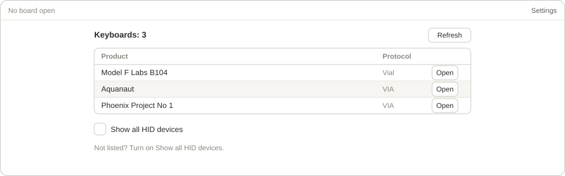

**2. A board with a keymap only** — the most common case and the simplest screen: header,
layer strip, board, keycode picker. No column, since there is one section. Click a key, it is
outlined; click a keycode, it is written.

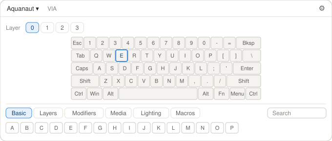

**3. A board with several sections.** Screen 2 plus the column, listing only what this board
has. The header shows the lock state, Vial only.

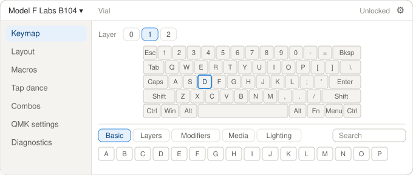

**4. Choosing a definition** — only when more than one definition matches a VIA board. With
two or three candidates, each is drawn small beside its name and where it came from; more are
handled as in the next section. The answer is remembered per board, as it is today.

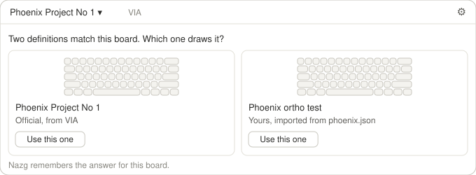

**5. Macros on a locked board.** The strip lists the macro slots; the panel, the selected
macro's actions. Vial refuses a macro write while locked (via-vial-commands.md, "What the
lock gates"), so the panel says so, and the board highlights the keys to hold — the firmware
reports them in `vial_get_unlock_status`. Once unlocked, the message goes and the actions
become editable. The keymap needs no such screen: Vial accepts keymap writes while locked,
`QK_BOOT` aside, which the read-back already reports.

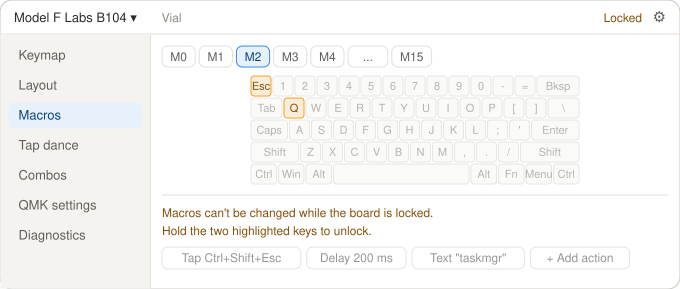

**6. Settings**, from the settings button. It replaces the main area; the header stays, so
the open board is still named. The host layout and the user definitions library (Re-import,
Remove, Import) move here from today's HID Devices window. "Back to the board" returns where
you were.

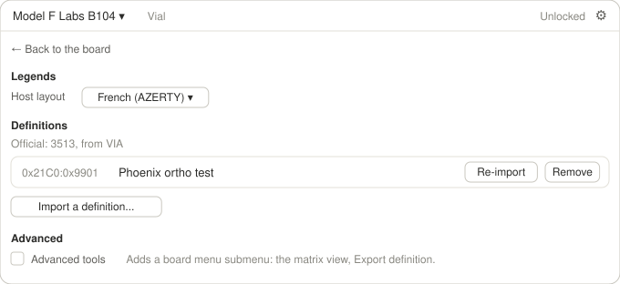

Settings also holds **Advanced tools**, a switch **off by default** (Rico, 2026-09-29).
Designer and debugging tools stay out of an ordinary user's way: turned on, the board menu
gains an *Advanced* submenu (see "Getting back to the keyboard list"). VIA does the same with
its Design pane, hidden until enabled in its settings.

## Choosing among many definitions

VIA's registry allows one official definition per VID:PID, so many candidates are always the
user's own: hobbyists on QMK's placeholder id (`0xFEED:0x0000` alone is on 175 QMK keyboards,
via-registry.md, "VID:PID collisions in QMK"), designers whose prototypes and revisions keep
one id, "Keep both" adding an entry each time.

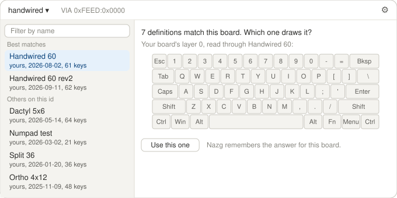

1. **A ranked list and one large preview**, past three candidates. The ranking is the one
   already decided (via-registry.md, "Choosing a definition on connect"): user, community,
   official, then how closely the name matches the product string. The names that match form
   "Best matches"; the top one is preselected, so the usual answer is one click. The filter
   box appears only for a long list, about eight or more. Two or three candidates keep the
   side-by-side cards of screen 4, which compare better directly.
2. **The preview shows the board's real keymap, not blank keys.** Layer 0 starts at offset 0
   of the keymap buffer whatever the matrix, so Nazg reads it once — sized for the largest
   candidate, a few hundred bytes, some 10–20 round trips against the 890 ms of a full load —
   and draws it through each candidate. The right definition shows the user's own keymap in
   sensible places; a wrong matrix scatters the legends. People recognise their own keymap at
   once, even when two drawings have the same shape.

   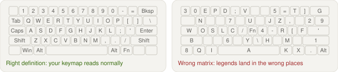
3. **The preview uses the board's stored layout options**, read from the board, instead of
   the first choice of each option — what the user would get by picking it.

**Untested:** point 2 has not been tried; the first test is the Phoenix Project No 1 with the
forged ortho definition. A layer 0 that is mostly `KC_TRNS` or blank would show little.

**Provisional:** a "not chosen by any board" hint in Settings, to help remove stale
definitions — an extra whose value is unproven.

## Getting back to the keyboard list

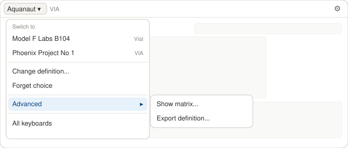

The board's name in the header is a menu, as in ZMK Studio and VIA:

- **Switch to** — the other keyboards plugged in, one click each: the usual reason to go back.
- **Change definition… / Forget choice** — VIA boards only; they leave the board screen.
- **Advanced** — only with *Advanced tools* on in Settings: **Show matrix…** (the matrix
  view, below) and **Export definition…** (the definition drawing the board, byte for byte,
  for investigation and debugging). The picture shows it open.
- **All keyboards** — closes the board and shows the list.

It adds nothing to the first glance — the name is already there — and it is the only way to
the list when Nazg opened a lone board directly. The list also comes back by itself when the
open board is unplugged, saying which one went.

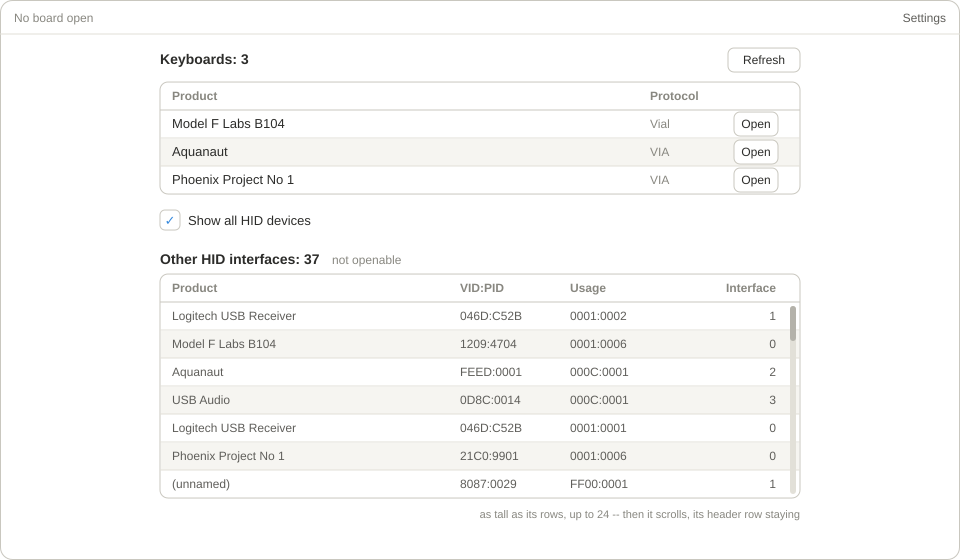

**Show all HID devices** is a toggle on the list itself, **off at every start** — today's
checkbox already behaves so. Turned on, keyboards stay on top with *Open*, and every other
HID interface is listed under them, dimmed, with VID:PID, usage page and interface number,
and cannot be opened. The technical columns exist only in that view. (The ids in the picture
are illustrative.) **Refresh** stays on the list.

## The matrix view

How the board is wired: which row and which column of the switch matrix each key sits on.
Mostly for designers and anyone debugging a build, so it is **opened from the board menu's
Advanced submenu** ("Show matrix…", only with *Advanced tools* on) rather than being a section — a section would bring the column back on every
keymap-only board, since every board has the data.

### What VIA and Vial do

- **VIA** draws the structure with "Show Matrix", in its Design pane — hidden until enabled in
  Settings — and in its Debug pane (`components/three-fiber/matrix-lines.tsx`,
  `components/n-links/matrix-lines.ts` in `the-via/app`). Every row is a pink line and every
  column a grey one, **all at once, unlabelled**; points are joined in screen order — rows by
  x, columns by y — not in column or row number order, so a line zigzags wherever the wiring
  does not follow the key positions; and the keys of **every** layout option are included
  (only encoders and decals are left out), so alternative keys stack and lines run through
  them. Its Key Tester also has a live "Test Matrix" mode.
- **Vial** draws no structure. Its **Matrix tester** tab lights keys on the board as they are
  pressed, polled every 20 ms, and asks for an unlock first.

### What it needs

- **The structure is definition data only**: each key's row and column (its KLE `"r,c"`
  legend) and the matrix size. No protocol, every VIA and Vial board, even with no board
  plugged in — and Nazg already has it.
- **The live test needs the firmware's consent**, deliberately: `id_switch_matrix_state`
  (via-vial-commands.md). Mainline VIA answers **all zeroes** unless built with
  `VIA_INSECURE`, or with `SECURE_ENABLE` and unlocked — QMK calls the alternative a "wannabe
  keylogger" — and all zeroes cannot be told from "nothing pressed", so the screen must say
  that if nothing lights, the firmware turns the test off. Vial needs protocol 3 or later
  and an unlocked board. It is cheap: `28 / ceil(cols/8)` rows per reply, the whole matrix in
  one request on most boards.

### One view, with rulers

One view, the board, with a **row ruler on the left and a column ruler on top**. (A first
draft had a second view, the matrix as a grid in the panel; one view proved far more legible.)

No selection:

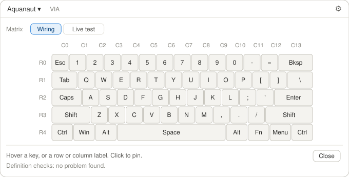

A key selected and pinned — V, on row 3 and column 5:

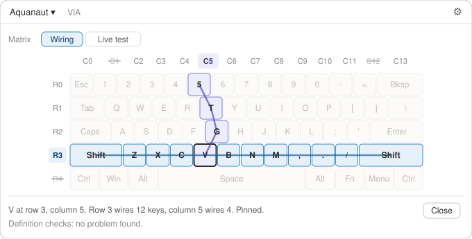

**Interactive version:** [ui-design/matrix-view.html](ui-design/matrix-view.html) — open it
in a browser; GitHub and Markdown previews show only its source.

- **Hover a key**: its row and its column light, on the board and in both rulers — the row
  in one colour, the column in another — with their keys **joined by the shortest links**
  (a minimum spanning tree over the key centres). Everything else dims. A row is a *set* of
  keys: its column numbers say which pin reads each key, not where the trace runs, so no
  order is drawn. A first build joined keys in number order, and on the Model F B104 — rows
  numbered out of screen order — a column became a zigzag from F2 down to Left Alt and back
  up (2026-09-29); VIA's screen order zigzags too, wherever a row is staggered. On a regular
  board the links are the straight line through the row.
- **Hover a ruler label**: that whole row or column.
- **Click** pins the selection, to move the mouse away.
- **Positions with no key** — what the grid showed and the board alone cannot: with a row
  selected, the columns with no key in it are **struck through** in the column ruler, and
  the other way round. In the picture, C1 (the ISO key's position) and C12 on row 3, R4 on
  column 5.
- A ruler label is **centred on its key nearest the edge** — a column's on its top key, a
  row's on its leftmost — nudged apart so none overlap, counting one key per position, the
  first in the definition, so a key wired in parallel far away does not take the label. (The
  first build placed it at the average of its keys: a column's keys differ in width, so on the
  Concordia C3 sat right of Esc, above nothing — Rico, 2026-09-29.) On a regular board they
  line up with the keys; on a board whose wiring does not follow its
  layout — split halves numbered 5 to 9, a Model F's matrix — they cannot, the ruler is then
  an ordered list, and the drawn line shows where the row really runs.
- **Live test** (the strip: *Wiring | Live test*): keys turn green as they are seen, with a
  count — a checklist for a freshly soldered board. A ruler label turns green when its whole
  row or column was seen; one that stays grey points at that trace, and a key lighting
  unpressed points at ghosting from a missing diode. **A view of its own** (2026-09-29): no
  hover, no wiring lines, no dimming -- a first build kept the wiring under the test, and the
  two could not be told apart. The board under test types into Nazg meanwhile, so keyboard
  navigation is off while it runs.
- **The panel**: the status line, the seen count, what the definition says about its matrix
  (below), and *Close*, back to the keymap.

### What the definition says about its matrix

Nothing here prevents anything: every definition loads and draws as before. The matrix view
only says what it finds, in its panel, and nothing is checked on import — an ordinary user
could do nothing about it. Decided with Rico 2026-09-29, after a scan of all 3513 of VIA's
official definitions (2029 V3, 1484 V2) with Nazg's parser:

| Situation | In the official definitions | Shown as |
|---|---|---|
| **Keys at different spots on one position** | 88 definitions (49 V3), 126 pairs | **A fact.** Two switches wired in parallel to one position are a legitimate design, unusual as it is (Rico): pressing either closes the same switch. Hovering one lights both, and the panel says "2 keys at row 5, column 11" rather than naming one. |
| **Two keys drawn exactly on top of each other** | 10 of those pairs (AEKISO60, TIDBIT…) | **A note.** Invisible on the board, so almost certainly a leftover copy in the definition. |
| **A key outside the matrix size** | none — VIA's registry rejects it (`validateKeyBounds()`, `the-via/reader`) | **A warning.** The firmware has no such position: that key can never be read, remapped or tested. Only an imported file or a Vial board can bring one. |
| **Positions no key uses** | 3015 definitions (86%), 12% of all cells | **Nothing.** Normal on most boards; the rulers already strike them through for the row or column in focus. |

QMK checks the same things at build time — keys inside the matrix, no position twice in one
`LAYOUT` (`lib/python/qmk/info.py`) — but in `keyboard.json`, not in the VIA definition, which
it never reads. Nothing ties the two files together, so a firmware that builds cleanly can ship
a definition with a mistyped `"r,c"`.

## The console

The text a QMK firmware prints — `print`, `uprintf`, `dprintf` — shown in Nazg, so debugging
a firmware needs no second app. Today that app is QMK Toolbox, whose output cannot be selected
or copied, or PJRC's `hid_listen`.

**Off by default, three ways.** The *Console* button exists only on a board that has a
console interface; the drawer is **closed at every start**, like "Show all HID devices"; and
Nazg **does not open the console interface at all** until the drawer is opened — nothing is
read, nothing is kept, until the user asks.

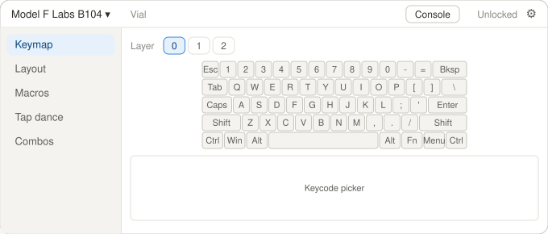

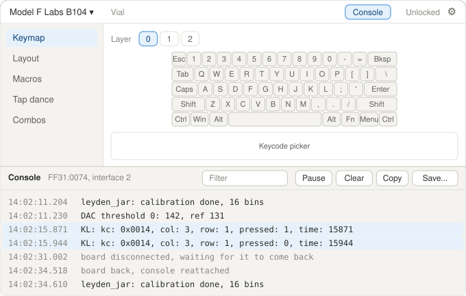

### What QMK sends

`CONSOLE_ENABLE` adds a **second HID interface** to the board, next to VIA's raw HID one
(`0xFF60`/`0x61`): usage page **`0xFF31`**, usage **`0x74`** — PJRC's Teensy convention,
the one QMK Toolbox and `hid_listen` listen on. It goes **one way**, board to host: the text
in 32-byte input reports, buffered by `sendchar()` and flushed by `console_task()`. There
are no commands — the board cannot be asked anything through it, and `dprintf` prints only
while the firmware's `debug_enable` is set, which the firmware sets itself (in code, or with
the `DB_TOGG` key). Vial is QMK underneath and sends the same. (QMK:
`tmk_core/protocol/usb_descriptor.c`, `tmk_core/protocol/chibios/usb_main.c`,
`docs/faq_debug.md`.)

### What it takes

- **Transport**: a second open handle on the same board, and a reader for reports that
  arrive unasked. Today's transport does request and response only; the architecture
  already puts "async request/response + unsolicited messages" in the transport, and this is
  its first use. **No protocol code** — plain text, no VIA or Vial involved.
- **Pairing the interface with the board**: hidapi lists it as a separate entry. It is
  attached to the open board by VID:PID, HID strings and serial number. Two identical boards
  without a serial number are ambiguous; Nazg then asks which.
- **Boards without VIA**: a board with only `CONSOLE_ENABLE` can be listened to as well — a
  *Console* button on its row of the keyboard list, among the interfaces "Show all HID
  devices" reveals.
- **Surviving a reflash**: the console is for firmware work, so the board goes and comes
  back often. The log is kept, marked where the board left and returned, and the console is
  reattached to the same board by itself — which needs hotplug events or, while the drawer is
  open, re-listing devices about once a second (see "Open points").
- **Text that can be selected and copied** — what QMK Toolbox lacks. ImGui has no selectable
  text for free: lines are selected with its multi-select (click, shift-click, Ctrl+A),
  **Copy** takes the selection, **Save…** writes the log to a file. Also **Pause**, **Clear**,
  a filter, timestamps, and a cap on the number of lines kept, so a chatty board cannot use
  up memory.
- **Privacy**: with the firmware's `debug_keyboard` on, QMK prints every keyboard report it
  sends to the host (`tmk_core/protocol/host.c`) — the log can hold all that was typed. It lives **in memory only**, is written to disk only by
  *Save…*, and is gone when Nazg closes.

### Where it sits

**A drawer at the bottom of the window**, like an IDE's terminal: the regions above shrink
and stay usable. Not a section, and not a view replacing the main area like the matrix view —
the point is watching the output *while* using the keymap or the matrix live test. It opens
from the *Console* button in the header.

The same drawer could later show logs from other sources: XAP's log broadcasts, ZMK's USB
logging — which is a serial port, not HID, so it needs a serial transport, the one a ZMK
Studio backend needs anyway. Flashing, QMK Toolbox's other job, is not part of this.

## Open points

- **Plugin delivery** — see "Plugins".
- **Hotplug** -- checked 2026-09-26:
  - **hidapi has none, pinned or released.** 0.15.0 has no hotplug API, nor does upstream
    `master` (2026-08-14). It is being built on branches (`connection-callback`, the
    `hotplug-*` ones, active into September 2026) as `hid_hotplug_register_callback()` for
    **0.16.0**, unreleased. Its callbacks arrive on hidapi's own thread.
  - **SDL3 has a change counter, and Nazg already links SDL.** `SDL_hid_device_change_count()`
    (since 3.2.0) returns a number that grows when a device may have come or gone -- not which
    one. It is fed by the OS: `RegisterDeviceNotification` on a message-only window on Windows
    (any device interface, so several ticks per board), IOKit notifications on macOS, udev or
    inotify on `/dev` on Linux; with none of them it ticks every 3 s instead. Polling it every
    frame costs nothing -- on Windows its messages arrive through `SDL_PollEvent()`. The first call
    runs `SDL_hid_init()` on SDL's own copy of hidapi, compiled in under other names, so it
    does not clash with Nazg's. An SDL call, so it stays in `Main.cpp`.
  - **So: poll the counter, re-enumerate on change** -- after a short pause, since one board
    brings several notifications and its HID interfaces appear one by one. Only paths not
    seen before are probed for their protocol, so the open board is never probed under a
    write. A board whose path has gone is closed, and the list says which one went. Not yet
    tried against a real plug and unplug.
  - **Deferred** (Rico, 2026-09-26): too soon. It becomes necessary the day the Refresh
    button is removed, so it is built then. Until then an unplugged board is noticed by a
    failed request and the list needs Refresh.
- **Which sections fold the board away**, and whether folding it confuses more than it helps.
- **Row labels on a board whose rows share a line** (Rico, 2026-10-01, from the mockup): on
  the Model F, R3 and R4 both have their leftmost key on the Caps Lock row, so spreading them
  apart puts R4 between two rows and nudges R2 off its own. To revisit when the board's look
  is built -- one idea: rows sharing a line sit side by side on it, "R3 R4".
- **The matrix view's layout options**: it draws the board's stored choice, as the
  many-candidates preview does, and the keys of the other choices are not shown — the first
  build's default, which the panel states. How those keys could show is still open.
- **"Export definition…"**, for investigation and debugging only: put in the board menu,
  under the definition items, with the workspace frame. Moves to the Advanced submenu with
  *Advanced tools* (2026-09-29), built the same day.
- The three suggestions Rico accepted with the screens, worth confirming in use: opening a
  lone board directly; listing only the sections a board has; Settings replacing the main
  area rather than opening a dialog.
- **The interface's language** (Rico, 2026-09-29): a future feature -- the text of Nazg itself
  in another language, chosen in Settings. Not built, but it shapes the design as a whole, so
  the screens should not rule it out. What it asks of them, as far as seen today:
  - **No fixed text widths.** A translation runs longer -- German often by a third -- so a
    button, a strip entry or a panel line is sized by its text, and long lines wrap (the matrix
    panel already does).
  - **Whole sentences, not pieces.** "Seen 3 of 20 keys" built from fragments cannot be
    translated: word order and plurals differ. A message is one format with its numbers in
    it, and the numbers can move.
  - **An ImGui label is also its ID.** Translated, the ID would change with the language; a
    widget whose label is shown text needs a fixed `##id`.
  - **The font must cover the script.** The system font loaded in `Main.cpp` is a first draft;
    ImGui 1.92 loads glyphs as they are needed, but only from fonts it was given. A Chinese,
    Japanese or Korean interface needs CJK fonts for its own text -- the legends need none
    (2026-10-03) -- added with that translation: a font-loading change in `Main.cpp`, nothing
    structural. How they are delivered -- bundled, fetched on first use, or the system's --
    weighs their size and is decided then.
  - **Right-to-left scripts are out of reach**: ImGui has no bidirectional text or shaping.
  - **What is not translated**: keycode names (`KC_ESC`), and legends, which already follow
    the host layout -- a separate setting from the interface's language. What a board or a
    definition names -- a keyboard, a layout option, a VIA menu -- comes as its author wrote it.
